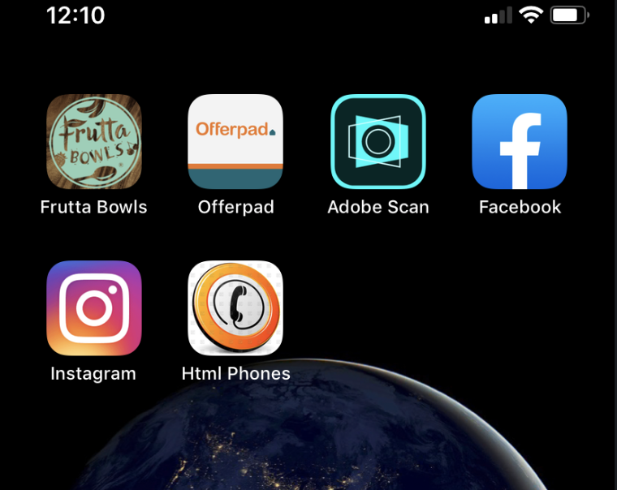
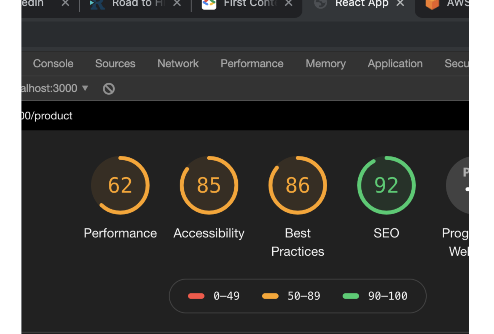
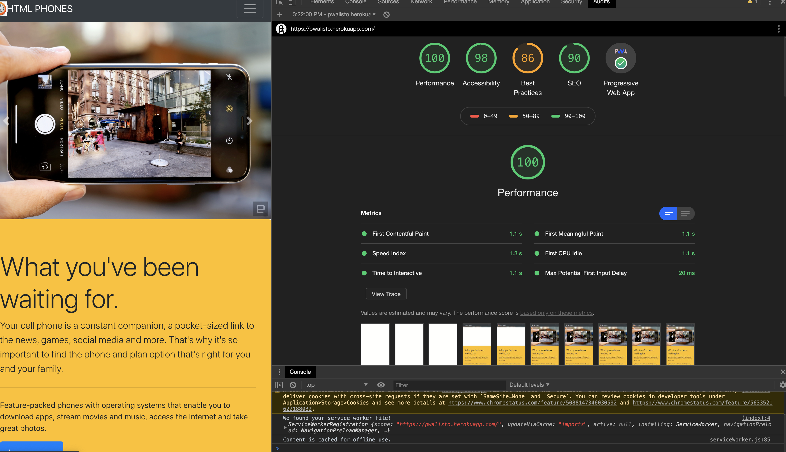

# Progressive Web App

PWA E-commerce project


# Project Title

MY E-commerce website with MongoDB and node.js
That also can be put on your homescreen just like a native app!

# PWA Audits

This initial screenshot is before learning the PWA metrics and how they function.



```
This screenshot is after learning the PWA metrics and how they function.

```



## Getting Started

These instructions will get you a copy of the project up and running on your local machine for development and testing purposes. See deployment for notes on how to deploy the project on a live system.

-download repo
-npm start

### Prerequisites

What things you need to install the software and how to install them

Must know how to use CLI
and starting commands

```
Give examples
```

### Installing

must be in client to use NPM start

## Authors

Juan Rosario

## License

This project is licensed under the MIT License - see the [LICENSE.md](LICENSE.md) file for details

## Acknowledgments

- Hat tip to anyone whose code was used
- Inspiration
- etc
